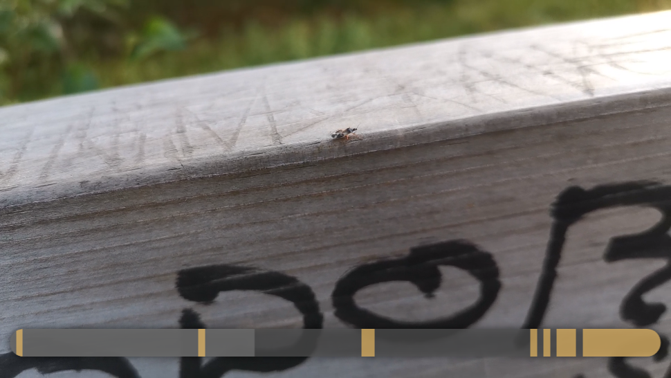

# What
A HTML5 video player whose seek bar indicates magnitude peaks in the video's audio.

In the screenshot, above, the yellow portions of the seek bar indicate the parts of the video that contain acoustic peaks (e.g. speech).

### Project status

Originally, I began writing What to solve a friend's need - but a long story short, they're prevented from using it for the time being.

As such, What has remained in **alpha** and is currently not under active development. It's not finished, it's not polished, it's not production-ready, but if it works for your needs, great!

# How it works
This fairly simple program uses HTML5's \<video\> element to play the video, and the AudioContext API to extract the video's audio into an array of raw samples.

The raw audio samples are compared against each other to find the acoustic peaks; and an SVG-based seek bar is created, accordingly.

# Usage
Provide What via a server, and access [index.html](index.html).

The page will ask you to point it to a video on your system. The video is then loaded in, processed for audio peaks, and played in-browser.

Note: Since this is alpha software, certain features are missing or only partially implemented. For instance, there's no ability to pause and resume the video playback.
