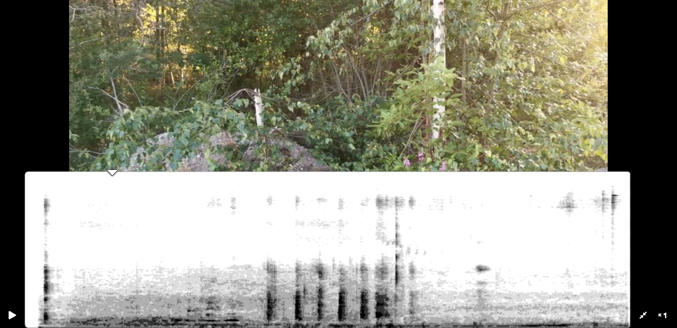

# What?
A HTML5 video player whose seek bar is a spectrogram of the video's audio.

# How it works
Output from a \<video\> element is sampled with an AnalyserNode, producing a time-variant spectrum, which is painted onto a \<canvas>.

# Usage
Put the contents of [distributable/](./distributable/) on a server, and browse to it.

The index page will ask you to provide a video file. Once you do so, the video will/should begin to play, and the spectrogram starts getting built. You can click on the spectrogram bar to seek the video.

To speed things up, you can set a higher playback rate by clicking in the bottom right corner where it says "x1".

*Note:* This software is currently work in progress and may not work as intended.
